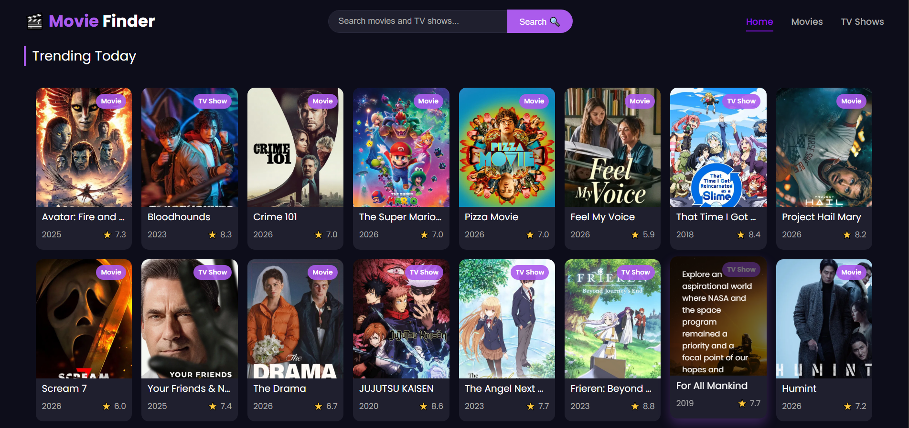
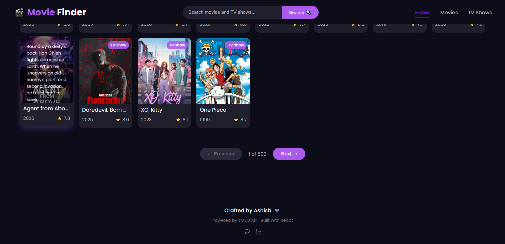
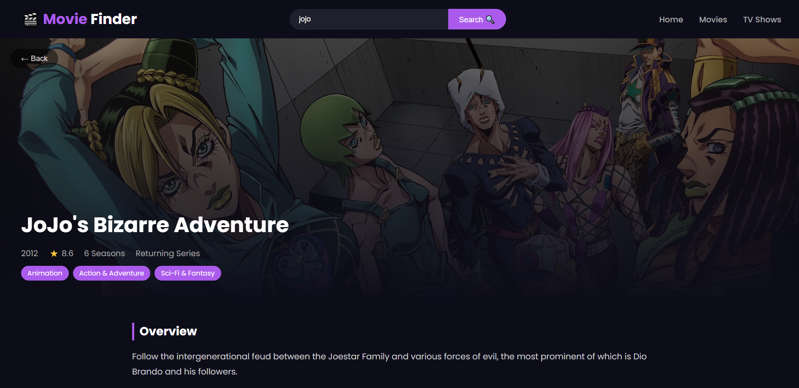

# MovieFinder 🎬

A full featured movie and TV show discovery app built with React.
Search, browse trending content, and explore detailed information
including trailers and cast.

## Live Demo
[View Live App](https://ashish-moviefinder.vercel.app/)

## Screenshots

## Features
- Search movies and TV shows
- Trending movies and TV shows
- Top rated movies and TV shows
- Full detail page with trailer and cast
- Pagination — browse hundreds of pages
- Mobile responsive with hamburger menu
- Dynamic movie/TV show badges

## Built With
- React
- React Router
- Vite
- TMDB API
- CSS3

## Getting Started
1. Clone the repo
2. Run `npm install`
3. Create a `.env` file and add your TMDB API key:
VITE_TMDB_API_KEY=your_key_here
4. Run `npm run dev`

## API
This app uses the [TMDB API](https://www.themoviedb.org/documentation/api).
